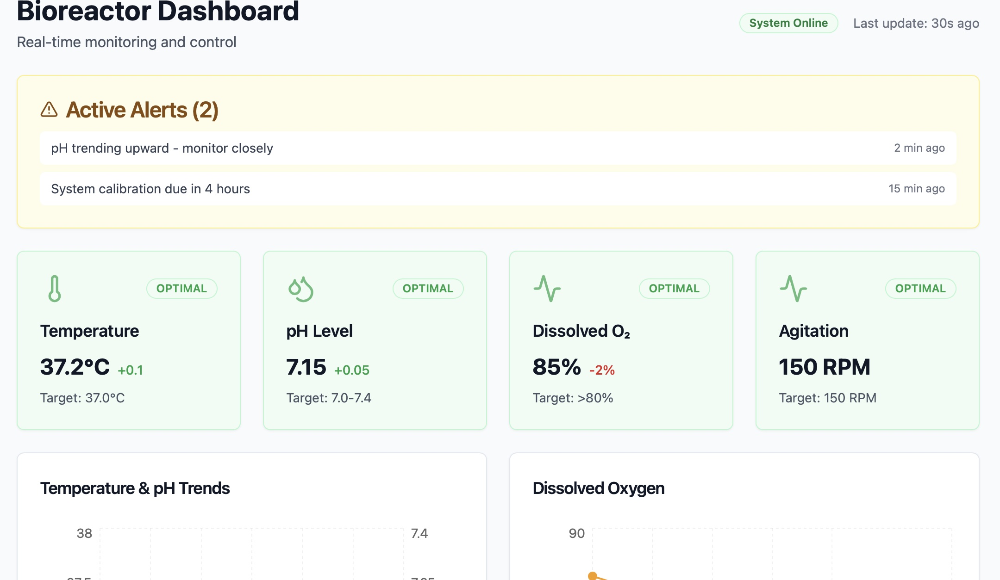

# Lovable Test Project

Create web app protypes using [Lovable](https://lovable.dev/)

## Create Prototype Bioreactor Dashboard



## Test Locally

```sh

# Install the necessary dependencies.
npm i

# Start the development server with auto-reloading and an instant preview.
npm run dev
```
